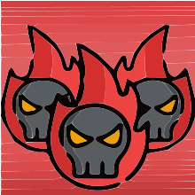

# Attribution
## Collaborators

### Created by 
[Dirge](https://github.com/Dirga36)  

## Sourced

### Sprites
#### Pixel Health bar
Author: [BDragon1727](https://bdragon1727.itch.io)  
Source: [https://bdragon1727.itch.io/basic-pixel-health-bar-and-scroll-bar](https://bdragon1727.itch.io/basic-pixel-health-bar-and-scroll-bar)  
License: Free to use on non-commercial games

#### Godot Engine Logo
Author: Andrea Calabró  
Source: [godotengine.org : press](https://godotengine.org/press/)  
License: [CC BY 4.0 International](https://github.com/godotengine/godot/blob/master/LOGO_LICENSE.txt) 

## Tools
#### Godot
  
Author: [Juan Linietsky, Ariel Manzur, and contributors](https://godotengine.org/contact)  
Source: [godotengine.org](https://godotengine.org/)  
License: [MIT License](https://github.com/godotengine/godot/blob/master/LICENSE.txt) 

#### Godot Game Template
  
Author: [Marek Belski and contributors](https://github.com/Maaack/Godot-Game-Template/graphs/contributors)  
Source: [github: Godot-Game-Template](https://github.com/Maaack/Godot-Game-Template)  
License: [MIT License](/addons/maaacks_game_template/LICENSE.txt)  

#### Spawner
  
Author: [ArtinTheCoder](https://github.com/ArtinTheCoder)  
Source: [github: Spawner-Godot-Plugin](https://github.com/ArtinTheCoder/Spawner-Godot-Plugin)  
License: [MIT License](/addons/spawner/LICENSE)  

#### Git
  
Author: [Linus Torvalds](https://github.com/torvalds)  
Source: [git-scm.com](https://git-scm.com/downloads)  
License: [GNU General Public License version 2](https://opensource.org/licenses/GPL-2.0)
